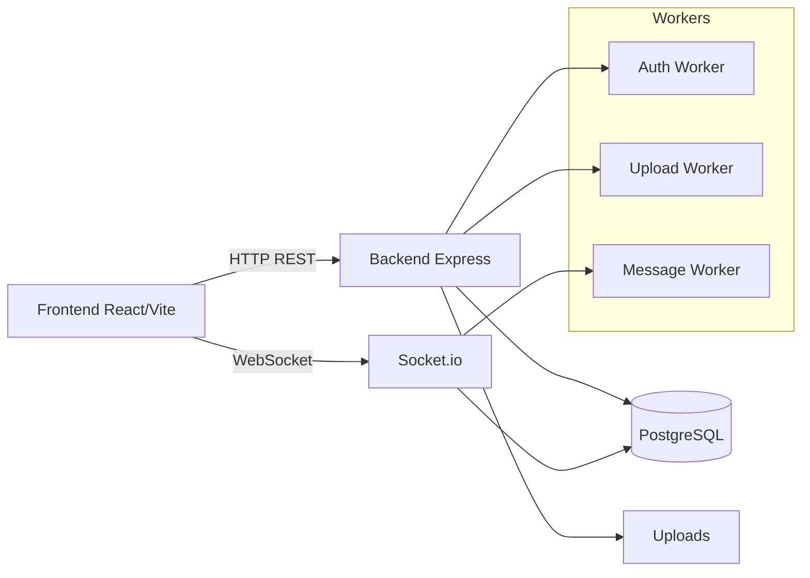

# SecureCollabChat

Sistema de chat en tiempo real con salas seguras. Incluye un panel de administrador para crear salas con PIN y un frontend web para que los usuarios ingresen de forma anonima usando su nombre y el PIN.

## Tema
Sistema de chat en tiempo real con salas seguras.

## Descripcion general
Aplicativo de chat en tiempo real con backend para logica, autenticacion (opcional), persistencia y comunicacion bidireccional; y frontend para interfaz responsiva. El enfoque principal es la gestion de salas por un administrador, acceso controlado por PIN y soporte para salas de texto y multimedia. Se usan hilos para operaciones concurrentes y se aplica sesion unica por dispositivo/IP.

## Caracteristicas
- Login de administrador con JWT
- Creacion de salas con ID unico y PIN (minimo 4 digitos)
- Salas de texto y multimedia
- Mensajeria en tiempo real con Socket.io
- Subida de archivos (imagenes y PDF) con limite 10MB
- Sesion unica por dispositivo/IP
- Desconexion por cierre de navegador o inactividad

## Arquitectura



## Requisitos
- Node.js 18+
- PostgreSQL 13+

## Instalacion

### Quick start (modo local)
1. Configura la base de datos y crea un usuario con permisos.
2. Configura variables de entorno del backend.
3. Inicia el backend y luego el frontend.
4. Abre http://localhost:5173

### Backend
```bash
cd backend
npm install
```

Variables de entorno (.env en backend):
```
DB_NAME=securechat
DB_USER=postgres
DB_PASSWORD=postgres
DB_HOST=localhost
DB_PORT=5432
JWT_SECRET=supersecret
BCRYPT_ROUNDS=10
INACTIVITY_MS=600000
```

Ejecutar backend:
```bash
npm start
```

### Frontend
```bash
cd frontend
npm install
npm run dev
```

Variables de entorno (frontend/.env):
```
VITE_API_URL=http://localhost:3000
VITE_SOCKET_URL=http://localhost:3000
```

## Uso
1. Ir a /admin e iniciar sesion.
2. Crear sala con PIN y tipo (texto o multimedia).
3. Compartir el PIN con los usuarios (el ID queda para referencia interna).
4. Usuarios ingresan con nombre y PIN. El nickname se genera automaticamente y es unico dentro de la sala.

## Flujo de usuario (resumen)
- El usuario ingresa su nombre y el PIN.
- El sistema genera un nickname unico dentro de la sala.
- Solo se permite una sesion activa por dispositivo/IP.

## Endpoints principales
- POST /api/admin/login
- POST /api/salas (admin)
- GET /api/salas (admin)
- DELETE /api/salas/:id (admin)
- POST /api/salas/join
- GET /api/salas/sesion?device_id=...
- GET /api/salas/:id/mensajes
- GET /api/salas/:id/usuarios
- POST /api/salas/:id/upload

## Estructura del proyecto
- backend: API Express, Socket.io, workers
- frontend: React/Vite, UI y servicios
- scripts: SQL inicial

## Pruebas
```bash
cd backend
npm test
```

## Carga
Para pruebas de carga puedes usar k6 o artillery con multiples conexiones WebSocket.

## Notas de seguridad
- El PIN se almacena encriptado con bcrypt.
- La sesion unica se valida por device_id e IP.
- Los archivos se almacenan en la carpeta uploads/ del backend.

## Requisitos funcionales (cumplimiento)
1. Autenticacion de administrador: login con usuario y contrasena.
2. Creacion de salas: ID unico, PIN minimo 4 digitos, tipo texto/multimedia.
3. Acceso de usuarios: ingreso con PIN y nickname unico (generado automaticamente).
4. Funcionalidades en sala: mensajes en tiempo real, archivos en multimedia, lista de usuarios, desconexion por cierre o inactividad.
5. Concurrencia: workers para autenticacion, persistencia de mensajes y subidas.

## Requisitos no funcionales (cumplimiento)
1. Tiempo real: Socket.io con latencia baja en red local.
2. Escalabilidad: disenado para salas con multiples usuarios; se recomienda prueba de carga.
3. Seguridad: PIN encriptado, validaciones basicas y sesion unica por dispositivo.
4. Interfaz: frontend responsivo.
5. Documentacion: README con instalacion, uso y diagrama de arquitectura.
