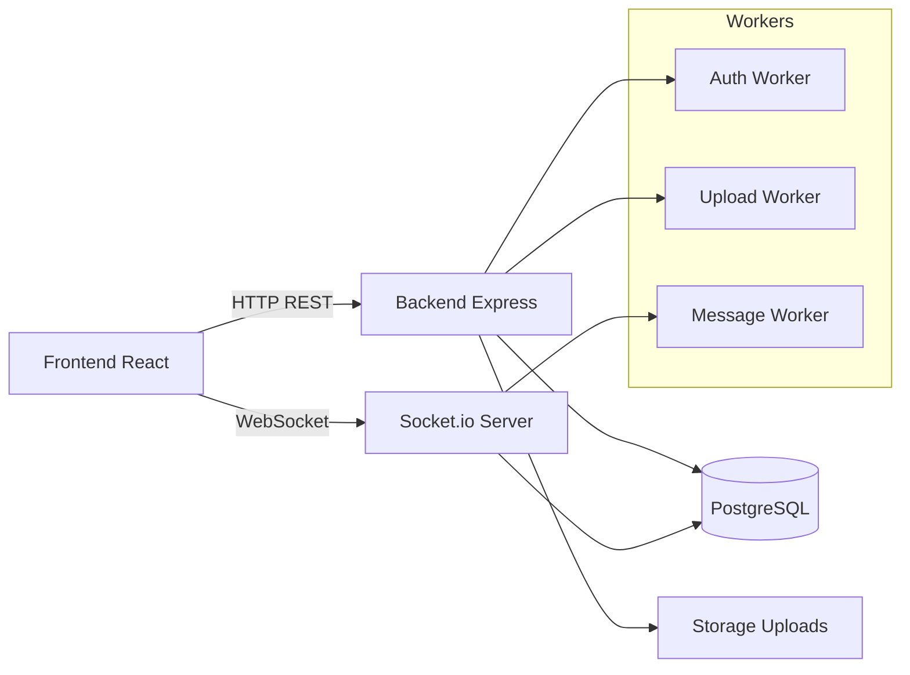
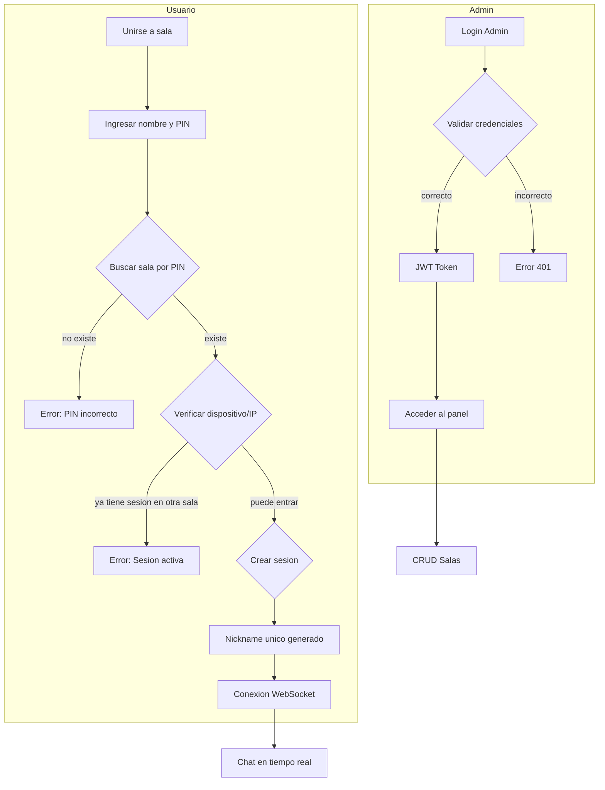
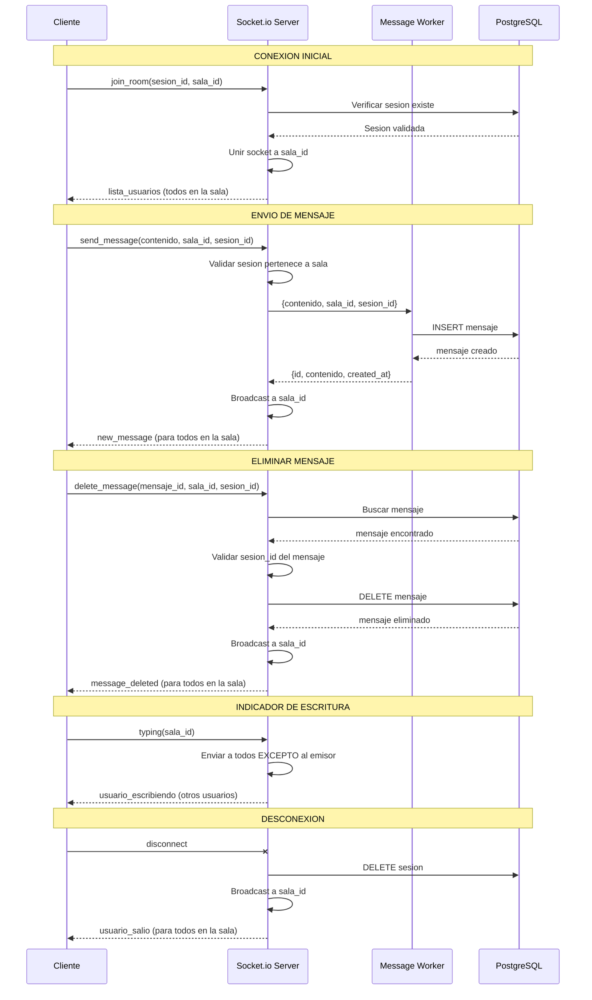

# SecureCollabChat

Sistema de chat en tiempo real con salas seguras. Incluye un panel de administrador para crear salas con PIN y un frontend web para que los usuarios ingresen de forma anónima usando su nombre y el PIN.

---

## Tema

Sistema de chat en tiempo real con salas seguras.

---

## Descripción General

Aplicativo de chat en tiempo real donde un administrador crea salas de chat con un PIN de acceso. Los usuarios se conectan ingresando su nombre y el PIN, obteniendo un nickname único generado automáticamente. El sistema soporta salas de texto y multimedia (con archivos). Toda la comunicación es en tiempo real mediante WebSockets, y se aplica sesión única por dispositivo/IP.

---

## Características

- Login de administrador con JWT
- Creación de salas con ID único y PIN (mínimo 4 dígitos)
- Dos tipos de sala: texto y multimedia
- Mensajería en tiempo real con Socket.io
- Subida de archivos (imágenes y PDF) con límite de 10MB en salas multimedia
- Sesión única por dispositivo e IP (no puede estar en dos salas a la vez)
- Desconexión automática por cierre de navegador o inactividad
- Indicador de usuarios escribiendo
- Panel de usuarios en tiempo real
- Arquitectura con Workers para procesos concurrentes

---

## Arquitectura General del Sistema

El sistema se divide en dos partes principales: el **Backend** (Node.js + Express) que maneja la lógica, autenticación, persistencia y comunicación en tiempo real, y el **Frontend** (React + Vite) que proporciona la interfaz responsiva.



El Backend y el Servidor de WebSockets comparten el mismo proceso, lo que permite al servidor Express acceder al objeto `io` de Socket.io para emitir eventos directamente desde los controladores. Los Workers son hilos separados que procesan operaciones pesadas (autenticación bcrypt, subida de archivos, persistencia de mensajes) sin bloquear el hilo principal del servidor.

---

## Arquitectura de Base de Datos

La base de datos PostgreSQL está diseñada con cuatro tablas principales que representan las entidades del sistema: **Sala**, **Sesion**, **Mensaje** y **Archivo**.

```mermaid
erDiagram
    SALA {
        string id PK "ID unico: ROOM-XXXX"
        string pin_hash "PIN encriptado con bcrypt"
        string tipo "texto o multimedia"
        datetime created_at "Fecha de creacion"
    }

    SESION {
        uuid id PK "UUID v4"
        string nombre_real "Nombre ingresado por el usuario"
        string nickname "Nombre unico en la sala: nombre#XXXX"
        string device_id "Identificador unico del navegador"
        string ip "Direccion IP del cliente"
        string socket_id "ID de conexion WebSocket"
        datetime created_at "Fecha de entrada"
        string sala_id FK "Sala a la que pertenece"
    }

    MENSAJE {
        int id PK "Auto-incremento"
        text contenido "Texto del mensaje"
        datetime created_at "Fecha de envio"
        string sala_id FK "Sala a la que pertenece"
        uuid sesion_id FK "Autor del mensaje"
    }

    ARCHIVO {
        int id PK "Auto-incremento"
        string url "Ruta del archivo en storage"
        string mimetype "Tipo MIME del archivo"
        int peso_bytes "Tamano en bytes"
        datetime created_at "Fecha de subida"
        int mensaje_id FK "Mensaje asociado"
    }

    SALA ||--o{ SESION : "tiene"
    SALA ||--o{ MENSAJE : "contiene"
    SESION ||--o{ MENSAJE : "escribe"
    MENSAJE ||--o| ARCHIVO : "tiene"

    SALA {
        note: "El PIN se guarda encriptado. No se almacena el PIN original."
    }

    SESION {
        note: "Un dispositivo/IP solo puede tener una sesion activa en una sala."
    }

    MENSAJE {
        note: "Los mensajes no se actualizan, solo se eliminan. No hay campo updated_at."
    }

    ARCHIVO {
        note: "Solo aplica para salas tipo multimedia."
    }
```

### Relaciones

- Una **Sala** puede tener muchas **Sesiones** (usuarios conectados).
- Una **Sala** puede tener muchos **Mensajes**.
- Una **Sesion** puede escribir muchos **Mensajes**.
- Un **Mensaje** puede tener un **Archivo** asociado (opcional).

---

## Arquitectura de Autenticación y Autorización

El sistema maneja dos niveles de acceso: el **Administrador** y los **Usuarios** de las salas.



### Flujo de Autenticación del Administrador

El administrador inicia sesión con usuario y contraseña. Las credenciales se comparan usando bcrypt contra el hash almacenado en el archivo `.env` del backend. Si son correctas, se genera un token JWT que expira en 24 horas. Este token debe enviarse en el header `Authorization: Bearer <token>` en todas las peticiones protegidas del panel de administración.

### Flujo de Sesión del Usuario

Cuando un usuario se une a una sala, el sistema sigue estos pasos: primero verifica que el PIN corresponda a una sala existente usando bcrypt.compare. Luego verifica que el dispositivo (device_id) no tenga una sesión activa en otra sala. También verifica que la dirección IP no tenga una sesión activa en otra sala. Si todo es válido, crea una nueva sesión con un nickname único generado automáticamente como "nombre#XXXX" (número aleatorio). El sistema permite que la misma IP esté en la misma sala con diferentes nicknames, pero no permite que la misma IP esté en salas diferentes.

### Autorización

- **Administrador**: Tiene acceso completo a CRUD de salas. Todas sus rutas están protegidas con middleware JWT.
- **Usuario**: Puede leer mensajes, enviar mensajes, subir archivos (en salas multimedia) y eliminar sus propios mensajes. No necesita autenticación formal, pero cada acción se valida contra su sesion_id y socket_id.

---

## Arquitectura de Comunicación WebSocket

El sistema utiliza Socket.io para la comunicación en tiempo real dentro de las salas. Todos los eventos están basados en el room de la sala, lo que permite que los mensajes se entreguen únicamente a los usuarios conectados a esa sala específica.



### Eventos de Socket.io

| Evento | Dirección | Descripción |
|--------|-----------|-------------|
| `join_room` | Cliente → Servidor | Unirse a una sala de chat |
| `lista_usuarios` | Servidor → Cliente | Lista de usuarios en la sala |
| `send_message` | Cliente → Servidor | Enviar mensaje de texto |
| `new_message` | Servidor → Cliente | Nuevo mensaje recibido |
| `delete_message` | Cliente → Servidor | Eliminar un mensaje propio |
| `message_deleted` | Servidor → Cliente | Notificación de mensaje eliminado |
| `archivo_subido` | Cliente → Servidor | Notificar que se subió un archivo |
| `new_file` | Servidor → Cliente | Nuevo archivo recibido |
| `typing` | Cliente → Servidor | Indicar que el usuario está escribiendo |
| `stop_typing` | Cliente → Servidor | Dejar de escribir |
| `usuario_escribiendo` | Servidor → Cliente | Alguien más está escribiendo |
| `usuario_dejo_escribir` | Servidor → Cliente | Alguien dejó de escribir |
| `usuario_entro` | Servidor → Cliente | Un usuario entró a la sala |
| `usuario_salio` | Servidor → Cliente | Un usuario salió de la sala |
| `sesion_cerrada` | Servidor → Cliente | La sesión fue cerrada (otra pestaña) |
| `error_evento` | Servidor → Cliente | Error en alguna operación |

### Flujo de Comunicación en una Sala

1. El usuario se une a la sala con su session_id y sala_id. El servidor verifica que la sesión exista y pertenezca a esa sala, luego une el socket al room de Socket.io.
2. El servidor emite `lista_usuarios` al nuevo usuario con todos los que ya están en la sala, y emite `usuario_entro` a todos los demás.
3. Al enviar un mensaje, el cliente emite `send_message`. El servidor crea el mensaje usando un Worker Thread para no bloquear, y luego hace broadcast de `new_message` a todos en la sala.
4. El indicador de "escribiendo..." funciona con eventos `typing` y `stop_typing`. El servidor reenvía estos eventos solo a los otros usuarios en la sala (no al emisor).
5. La desconexión puede ser manual (botón salir) o automática (cerrar pestaña, inactividad). El servidor elimina la sesión de la base de datos y notifica a los demás usuarios con `usuario_salio`.

---

## Modelo de Datos de Mensajes en Tiempo Real

Cuando un mensaje se envía o recibe a través de WebSocket, la estructura de datos que viaja es la siguiente:

```javascript
// Mensaje de texto
{
  id: 123,
  contenido: "Hola a todos",
  sala_id: "ROOM-5678",
  sesion_id: "uuid-v4-del-autor",
  nickname: "Juan#4821",
  timestamp: "2026-05-11T10:30:00.000Z"
}

// Mensaje de archivo
{
  mensaje_id: 124,
  archivo: {
    url: "/uploads/archivo.pdf",
    mimetype: "application/pdf",
    peso_bytes: 1024000
  },
  nickname: "Pedro#3399",
  timestamp: "2026-05-11T10:31:00.000Z"
}

// Notificacion de eliminado
{
  mensaje_id: 123,
  sala_id: "ROOM-5678",
  timestamp: "2026-05-11T10:32:00.000Z"
}
```

---

## Reglas de Sesión Única

El sistema aplica las siguientes reglas para evitar conexiones múltiples desde el mismo dispositivo o IP:

| Escenario | Resultado |
|-----------|-----------|
| Mismo dispositivo + misma sala | Reutiliza sesión existente |
| Mismo dispositivo + sala diferente | Bloqueado |
| Misma IP + sala diferente | Bloqueado |
| Mismo dispositivo + misma sala (otro navegador) | Permite nueva sesión |
| Misma IP + misma sala (diferentes usuarios) | Permite diferentes sesiones |

El nickname se genera automáticamente añadiendo un número aleatorio de 4 dígitos al nombre ingresado, por ejemplo "Maria#2847", garantizando unicidad dentro de cada sala.

---

## Requisitos

- Node.js 18 o superior
- PostgreSQL 13 o superior

---

## Instalación

### 1. Configurar la base de datos

```bash
cd scripts
# Ejecutar init.sql en PostgreSQL para crear las tablas
```

### 2. Backend

```bash
cd backend
npm install
npm start
```

Crear archivo `backend/.env`:
```env
PORT=3000
DB_NAME=SecureCollabChat
DB_USER=kevin
DB_PASSWORD=espe123
DB_HOST=localhost
DB_PORT=5432
JWT_SECRET=CAMBIAR_EN_PRODUCCION_ESTE_SECRET
BCRYPT_ROUNDS=10
INACTIVITY_MS=600000
```

### 3. Frontend

```bash
cd frontend
npm install
npm run dev
```

Crear archivo `frontend/.env`:
```env
VITE_API_URL=http://localhost:3000
VITE_SOCKET_URL=http://localhost:3000
```

### 4. Abrir en el navegador

- Panel admin: http://localhost:5173/admin
- Chat usuario: http://localhost:5173

---

## Uso

1. Ir a `/admin` e iniciar sesión con las credenciales del administrador.
2. Crear una sala especificando un PIN (mínimo 4 dígitos) y el tipo (texto o multimedia).
3. Compartir el PIN con los usuarios. El ID de la sala es solo para referencia interna.
4. Los usuarios ingresan con su nombre y el PIN. El sistema genera un nickname único automáticamente.

---

## Estructura del Proyecto

```
SecureCollabChat/
├── backend/
│   ├── src/
│   │   ├── config/
│   │   │   ├── database.js       # Configuración de Sequelize
│   │   │   └── multer.js         # Configuración de subida de archivos
│   │   ├── controllers/
│   │   │   ├── adminController.js  # Login y registro de admin
│   │   │   └── salaController.js    # CRUD de salas y mensajes
│   │   ├── middleware/
│   │   │   └── auth.js             # Middleware JWT
│   │   ├── models/
│   │   │   ├── index.js          # Relaciones entre modelos
│   │   │   ├── admin.js
│   │   │   ├── archivo.js
│   │   │   ├── mensaje.js
│   │   │   ├── sala.js
│   │   │   └── sesion.js
│   │   ├── routers/
│   │   │   ├── adminRouter.js
│   │   │   └── salaRouter.js
│   │   ├── workers/
│   │   │   ├── authWorker.js      # Hash bcrypt en hilo separado
│   │   │   └── uploadWorker.js    # Procesamiento de archivos
│   │   ├── app.js               # Configuración de Express
│   │   ├── index.js             # Entry point
│   │   └── socketHandler.js     # Lógica de Socket.io
│   └── .env
├── frontend/
│   ├── src/
│   │   ├── components/
│   │   │   ├── chat/
│   │   │   │   └── ChatRoom.jsx  # Componente principal de chat
│   │   │   └── ui/               # Componentes de interfaz
│   │   ├── pages/
│   │   │   ├── AdminPage.jsx
│   │   │   ├── LoginPage.jsx
│   │   │   └── HomePage.jsx
│   │   ├── services/
│   │   │   ├── api.js           # Cliente HTTP Axios
│   │   │   └── socket.js        # Cliente Socket.io
│   │   ├── config/
│   │   │   └── constants.js     # URLs y endpoints
│   │   └── App.jsx
│   └── .env
├── scripts/
│   └── init.sql                 # Script de inicialización de BD
├── docker-compose.yml
└── README.md
```

---

## Endpoints de la API

### Administrador (protegidos con JWT)

| Método | Endpoint | Descripción |
|--------|----------|-------------|
| POST | /api/admin/login | Iniciar sesión |
| POST | /api/admin/registrar | Registrar admin (primer uso) |
| POST | /api/salas | Crear nueva sala |
| GET | /api/salas | Listar todas las salas |
| DELETE | /api/salas/:id | Eliminar sala |

### Usuario (públicos)

| Método | Endpoint | Descripción |
|--------|----------|-------------|
| POST | /api/salas/join | Unirse a una sala con PIN |
| GET | /api/salas/sesion?device_id=... | Obtener sesión activa |
| GET | /api/salas/:id/mensajes | Obtener historial de mensajes |
| GET | /api/salas/:id/usuarios | Obtener usuarios conectados |
| POST | /api/salas/:id/upload | Subir archivo (solo multimedia) |
| DELETE | /api/salas/:id/mensajes/:mid | Eliminar mensaje propio |

---

## Requisitos Funcionales

| Requisito | Cumplimiento |
|-----------|---------------|
| Autenticación de administrador | Login con usuario y contraseña, JWT |
| Creación de salas | ID único, PIN encriptado, tipo texto/multimedia |
| Acceso de usuarios | PIN + nombre, nickname automático único |
| Mensajes en tiempo real | Socket.io con broadcast por sala |
| Archivos en multimedia | Multer + storage local, límite 10MB |
| Sesión única | Validación por device_id e IP |
| Desconexión por inactividad | Timer de 10 minutos configurable |
| Eliminar mensajes propios | Evento delete_message vía socket |

---

## Requisitos No Funcionales

| Requisito | Cumplimiento |
|-----------|---------------|
| Tiempo real | Socket.io, latencia menor a 100ms en red local |
| Concurrencia | Workers (hilos) para bcrypt, mensajes y archivos |
| Seguridad | PIN con bcrypt, JWT para admin, validación de sesiones |
| Interfaz responsiva | Tailwind CSS, diseño adaptativo |
| Documentación | README con diagramas y arquitectura |
| Escalabilidad | Diseño por sala, se recomienda pruebas de carga |